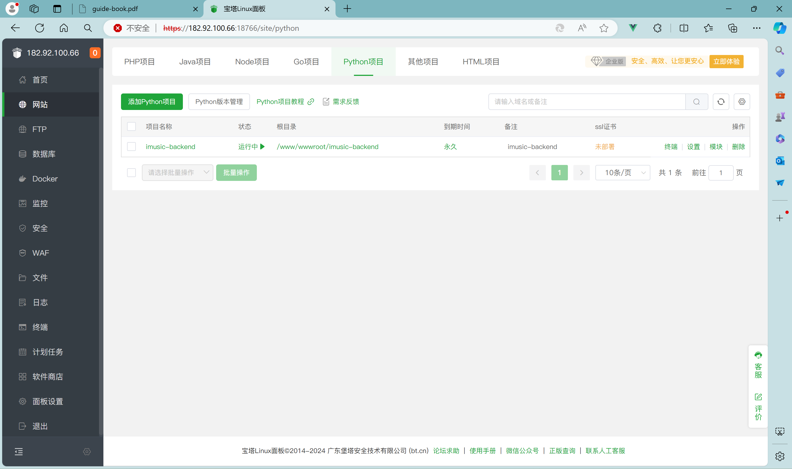
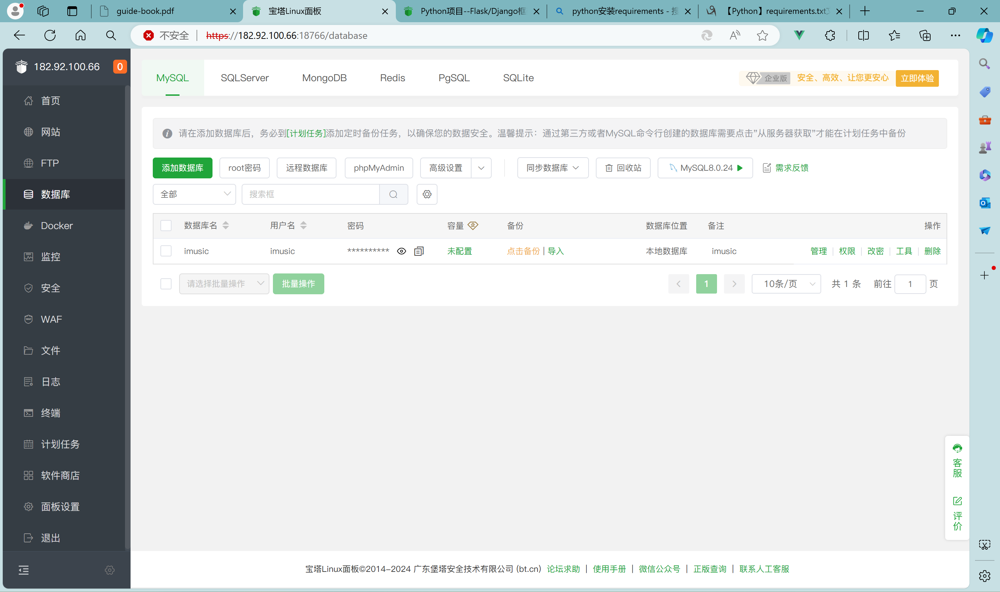
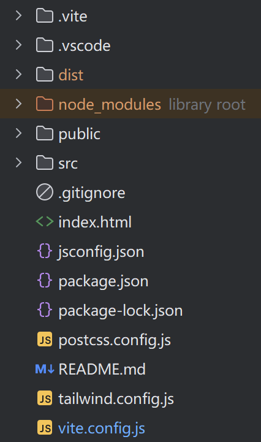
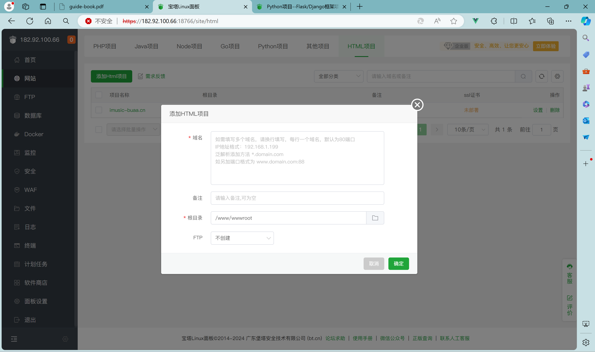
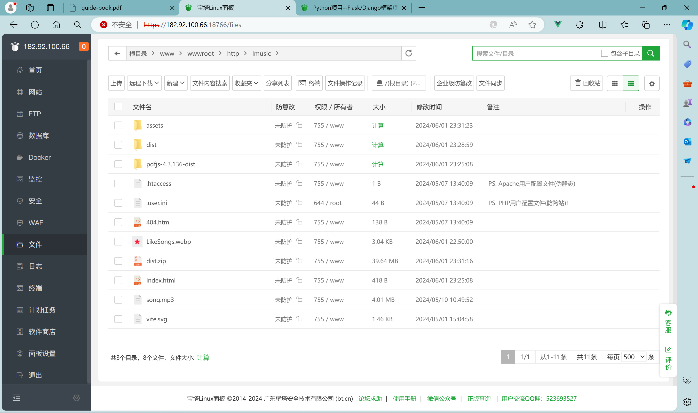
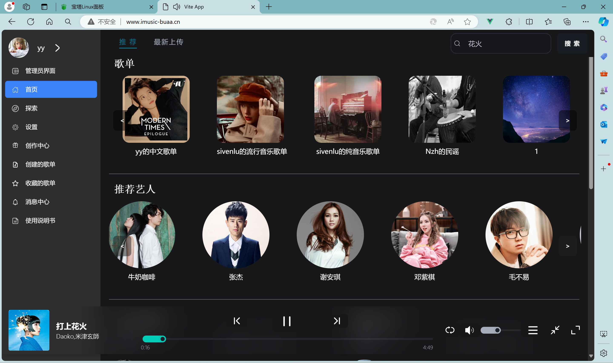

# 部署文档

[toc]

## 部署说明

我们小组为在线音乐播放平台租赁了一个服务器与一个数据库，故采用云端部署的形式运行项目。我们已经注册并购买了域名`imusic-buaa.cn`，访问http://www.imusic-buaa.cn即可

## 部署环境要求

我们项目对服务器带宽需求并不是很高，我们小组租赁的是阿里云的云服务器。

### 服务器配置

操作系统：Alibaba Cloud 3 (Soaring Falcon) x86_64(Py3.7.16)

CPU&内存：2核(vCPU) 2 GiB

处理器型号：Intel(R) Xeon(R) Platinum * 1

带宽：3Mbps带宽及以上网络适配器

磁盘容量：20 GiB及以上

宝塔面板：免费版8.1.0

Nginx版本：1.24.0及以上

数据库版本：MySQL8.0及以上

Python版本：3.12.0及以上

Django版本：5.0及以上

node版本：v20.12.2及以上

## 部署步骤

### 服务器设置

为了便于部署项目，我们使用宝塔面板，可以执行以下命令安装

```
wget -O install.sh https://download.bt.cn/install/install-ubuntu_6.0.sh && sudo bash install.sh ed8484bec
```

安装好后要记住自己的账号和密码，也可以注册一个宝塔账号，进入后台后像这样



我们的项目需要数据库，不过在宝塔面板上也很简单，跟随指示创建数据库即可，宝塔面板会自动生成数据库的账号和密码，还可以修改数据库的可视范围（仅当前服务器可见/所有IP可见）、数据库备份和导入等等，非常方便。



### 后端部署

我们项目后端依赖于Django，需要python环境，但是在宝塔面板上配置`python`环境非常轻松

首先拉取我们的项目，像这样(仓库地址不是真实的)

```
cd /www/wwwroot/ && git clone https://gitee.com/lylinux/DjangoBlog.git
```

接下来点击`python`项目创建


等待python项目创建


接下来执行我们项目里的`requirements.txt`文件，安装必要的环境，像这样

```
/www/server/pyporject_evn/DjangoBlog_venv/bin/python3 -m pip install -r requirements.txt
```

通过文件管理，进入到项目目录下。编辑Django/djangoblog目录下的setting.py文件，在编辑器内搜索database，修改成自己的数据库连接方式，像这样


这样就可以运行自己的项目了！

更详细的教程请参考[Python项目--Flask/Django框架项目部署 - Linux面板 - 宝塔面板论坛 (bt.cn)](https://www.bt.cn/bbs/thread-125161-1-1.html)

### 前端部署

前端部署则更简单，我们照例还是需要拉取仓库，执行`npm i`安装所需要的依赖

然后前端同学执行`npm run build`将项目打包，这时会在目录下生成一个dist文件夹



然后将该文件夹上传到宝塔面板的`/www/wwwroot/http`目录下，然后点击添加HTML项目，填写相关信息



将`dist`下的文件解压到该目录下即可完成部署



宝塔面板会默认将网站部署到`80`端口，访问服务器IP地址即可看到我们的项目，或者是访问域名



这样我们的部署就完成了！😎

## 权重分配

| 姓名 | 尹耀 | 薛惠天  | 卢思文  | 张旖霜  | 牛梓涵  |
| :--: | :--: |:----:|:----:|:----:|:----:|
| 权重 |  1   |  1   |  1   |  1   |  1   |

### 组员签字			


