# 用户使用说明书

[toc]

## 1 概述

### 1.1 背景

随着互联网和移动设备的普及，音乐爱好者越来越倾向于通过在线平台获取音乐资源。传统的音乐获取方式，如购买实体专辑或通过下载软件获取数字音乐，已经无法满足现代用户对便捷性和即时性的需求。同时，音乐产业的数字化转型也促进了各种音乐在线播放平台的兴起。

我们的音乐在线播放平台应运而生，旨在为用户提供一个高质量、易于使用的音乐流媒体服务。平台不仅涵盖了丰富的音乐资源，还集成了个性化推荐、播放列表管理、社交分享等功能，满足用户多样化的需求。

我们希望通过这个平台，让用户能够随时随地畅享音乐，发现新的音乐作品，分享他们的音乐体验，并与其他音乐爱好者互动。平台的开发过程中，我们重视用户体验，注重细节优化，力求为用户提供一个流畅、高效、愉悦的音乐使用环境。

### 1.2 编写目的

**介绍平台功能：** 用户使用说明书详细介绍平台的各项功能，包括如何播放音乐、创建和管理播放列表、使用个性化推荐、与朋友分享音乐等，使用户能够全面了解平台的所有功能。

**指导用户操作：** 说明书提供逐步操作指南，帮助用户快速上手和熟练使用平台。通过详细的步骤说明和图示，用户可以轻松完成注册、登录、搜索音乐、添加收藏等操作。

**提高用户体验：** 通过解释常见问题和提供使用技巧，帮助用户解决在使用过程中可能遇到的问题，提高用户满意度和使用体验。

**推动用户互动：** 说明书中鼓励用户参与平台的社区互动，分享音乐体验和发现，增强用户之间的交流和互动，形成良好的社区氛围。

**推动用户互动：** 说明书中鼓励用户参与平台的社区互动，分享音乐体验和发现，增强用户之间的交流和互动，形成良好的社区氛围。

### 1.3 项目使用者

热爱音乐的普通用户

需要便捷获取最新音乐的音乐发烧友

喜欢分享音乐和发现新音乐的年轻群体

### 1.4 相关文档

软件开发计划书

软件需求规格说明书

软件概要设计说明书

软件详细设计说明书

## 2 软件概述

### 2.1 项目目标

**提供优质的音乐流媒体服务：**

- 确保平台上的音乐资源丰富多样，涵盖不同风格和类型的音乐，满足用户的多样化需求。

- 提供高质量的音频播放，确保用户享受到最佳的听觉体验。

**打造便捷的用户体验：**

- 设计直观、易用的用户界面，让用户能够轻松地浏览、搜索和播放音乐。

- 提供流畅的播放体验，减少缓冲和中断，提升用户满意度。

**实现个性化推荐：**

- 利用相关算法和数据分析，根据用户的听歌习惯和偏好，提供个性化的音乐推荐，帮助用户发现新音乐。

**实现商业化和可持续发展：**

- 探索多种商业模式，如订阅服务、广告收入、付费下载等，实现平台的盈利和可持续发展。

- 不断优化和升级平台功能，提升用户满意度，吸引更多用户并保持用户忠诚度。

### 2.2 子系统介绍

1. **用户子系统**

- 管理用户：注册、登录、个人信息修改等功能。
- 用户注册：游客可以进行注册。
- 用户登录：已注册的用户可以进行登录。
- 管理个人信息：已登录的用户和管理员可以查看和修改自己的个人信息。

2. **歌单子系统**

- 已登录的用户可以使用全部功能，游客只能使用部分功能。
- 游客仅可以查看歌单以及对歌单中的歌曲进行播放操作。
- 歌单管理：已登录的用户可以创建歌单，并为自己创建的歌单设置标签分类，可以添加歌曲到自己创建的歌单，还能收藏歌单。
- 已登录的用户也能管理自己创建的歌单，进行修改和删除操作。

3. **歌曲子系统**

- 已登录的用户可以使用全部功能，游客只能使用部分功能。
- 游客仅可以查看歌单以及对歌单中的歌曲进行播放操作。
- 歌单管理：已登录的用户可以创建歌单，并为自己创建的歌单设置标签分类，可以添加歌曲到自己创建的歌单，还能收藏歌单。
- 已登录的用户也能管理自己创建的歌单，进行修改和删除操作。

4. **收藏子系统**

- 已登录的用户可以收藏和取消收藏歌单
- 已登录的用户可以将歌曲添加为喜欢的歌或者取消此操作

5. **消息子系统**

- 已登录用户可以收到自己歌单、歌曲在被投诉后被删除的消息。
- 已登录用户还可以收到自己关注的用户更新歌曲、歌单的消息。
- 定期给用户发送创作周报和听歌周报。
- 查看其他用户的主页、关注其他用户。
- 与互关的用户私信

6. **评论子系统**

- 用户可以查看每一首歌曲的评论。
- 登录的用户可以在歌曲播放页面中编辑评论

7. **审核子系统**

- 平台管理端收到投诉消息，进行审查。
- 管理端可以删除歌曲、取消分享歌单，也能撤销其操作。
- 管理端也能对平台用户进行管理。

### 2.3 功能模块介绍

**101 用户注册模块**

游客注册成为正式用户

**102 用户登录模块**

注册用户或管理员登录自己的账号

**103 用户信息修改模块**

已经登录的用户可以修改自己的个人信息

**104 用户关注和取消关注模块**

已经登录的用户可以关注其他用户或取消自己关注的用户

**201 播放歌曲模块**

用户点击目标歌曲播放按钮，播放歌曲，向用户展示歌曲详细信息

**202 上传歌曲模块**

已经登录的注册用户上传歌曲

**203 修改歌曲模块**

已经登录的用户可以修改自己上传的歌曲信息

**204 删除歌曲模块**

已登录用户可以点击删除自己上传的歌曲

**301 创建歌单模块**

已登录的用户可以创建自己的歌单

**302 查看歌单模块**

已登录的用户点击查看歌单信息按钮即可查看歌单信息

**303 修改歌单模块**

已经登录的用户可以修改自己创建的歌单信息

**304 删除歌单模块**

已登录用户可以点击删除自己创建的歌单

**305 添加歌曲至歌单模块**

已登录的用户可以将歌曲加入自己创建的歌单中

**401 收藏歌单模块**

用户点击收藏歌单按钮可以将歌单添加到【收藏的歌单】中

**402 取消收藏歌单模块**

用户点击取消收藏按钮可以将歌单从【收藏的歌单】中移除

**403 添加喜欢的歌曲模块**

用户点击喜欢按钮可以将歌曲添加到【我喜欢的歌】中

**404 取消喜欢的歌曲模块**

用户点击取消喜欢按钮可以将歌曲从【我喜欢的歌】中移除

**501 关注信息模块**

用户选择想关注的用户，添加关注，被关注者将看到新的被关注信息

**502 更新信息模块**

当被关注者更新了歌曲或歌单，关注者将收到相关信息

**503 上传信息模块**

当被关注者上传歌曲/创建歌单，关注者将收到相关信息

**504 听歌周报和创作周报模块**

根据用户历史信息创建听歌周报和创作周报，定时发送给用户

**505 评论消息模块**

用户发表评论后，系统将在上传者的消息页面展示评论消息

**601 投诉歌曲或歌单模块**

用户可以投诉歌曲或歌单，系统将在被投诉者和管理员的消息界面展示投诉通知信息，并向用户返回投诉结果

**602 申诉模块**

被投诉的用户可以进行申诉，系统将在管理员的消息界面展示申诉信息，并向用户返回申诉结果

**603 查看和处理投诉信息模块**

管理员可以查看投诉记录，并向被投诉者和投诉者发送投诉处理结果信息

**604 查看和处理申诉信息模块**

管理员可以查看申诉记录，并向被投诉者发送申诉处理结果信息

**701 添加评论模块**

已经登录的用户可以在歌曲播放页面发表评论

**702 查看评论模块**

用户可以在歌曲播放页面查看评论

**703 删除评论模块**

已经登录的用户可以在歌曲播放页面删除自己发表的评论

### 2.4 性能介绍

本项目前端运行在用户个人电脑或移动设备上，同时不涉及大量的前端运算，因此对于用户方的性能要求较低。后端处理大部分逻辑以及静态资源加载功能，因此主要性能瓶颈集中在后端部分，由于当前服务器规模及带宽受限，因此能够处理的并发较少，但是当项目实现稳定的盈利后，我们会尽快扩展服务器规模，增大贷款，实现更好的性能以及用户体验。

## 3 运行环境

### 3.1 硬件运行环境

CPU:Ryzen 7 7840hs或类似性能cpu，无需独立显卡支持

内存：32GB

操作系统：Macos或Windows或Linux

### 3.2 软件运行环境

需要现代浏览器支持

浏览器兼容：

Chrome:51-113

Edge:15-110

Safari:10-16.3-TP

Firefox:54-112

Opera:38-94

不支持IE浏览器

## 4 系统各页面进入方式

### 4.1 本地文件进入方式

本项目设置的为网页端，仅支持通过域名访问，不支持通过本地文件或客户端进入。

### 4.2 域名进入方式

本项目的域名为 http://www.imusic-buaa.cn/ ，输入该域名即可进入网站。

## 5 系统功能使用说明

### 5.1 登录/注册页面

#### 5.1.1 登录界面

**页面展示：**

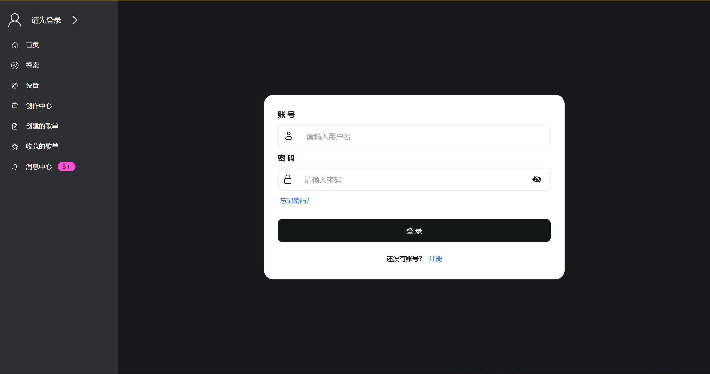

**页面内容及功能介绍：**

在登陆界面想要登录需要输入用户名和密码，如果没有注册的用户可以点击最下面的注册按钮进入注册界面，如果忘记密码了可以进入忘记密码界面找回密码，在输入正确的密码和用户名之后点击登录按钮会触发一个彩带的动画标示用户登录成功，并跳转到首页界面。

#### 5.1.2 注册界面

**页面展示：**

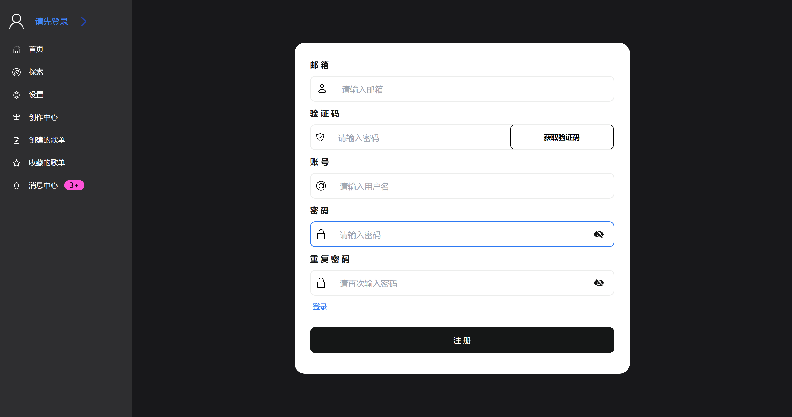

**页面内容及功能介绍：**

在注册界面用户需要首先输入邮箱，然后点击获取验证码按钮，这时会出现一个60s的倒计时，用户在60s内不能再次获取验证码，验证码的有效时间为3h，然后输入用户名和密码，并再次重复密码，如果两次密码输入均正确并且输入的用户名不存在，点击注册按钮，会成功创建账号。

#### 5.1.3 忘记密码界面

**页面展示：**

**页面内容及功能介绍：**

忘记密码界面操作和注册界面类似，都是需要通过邮箱获取验证码，并输入新的密码，点击更新密码即可找回密码。

### 5.2 用户个人信息页面

#### 5.2.1 修改个人信息页面

**页面展示：**

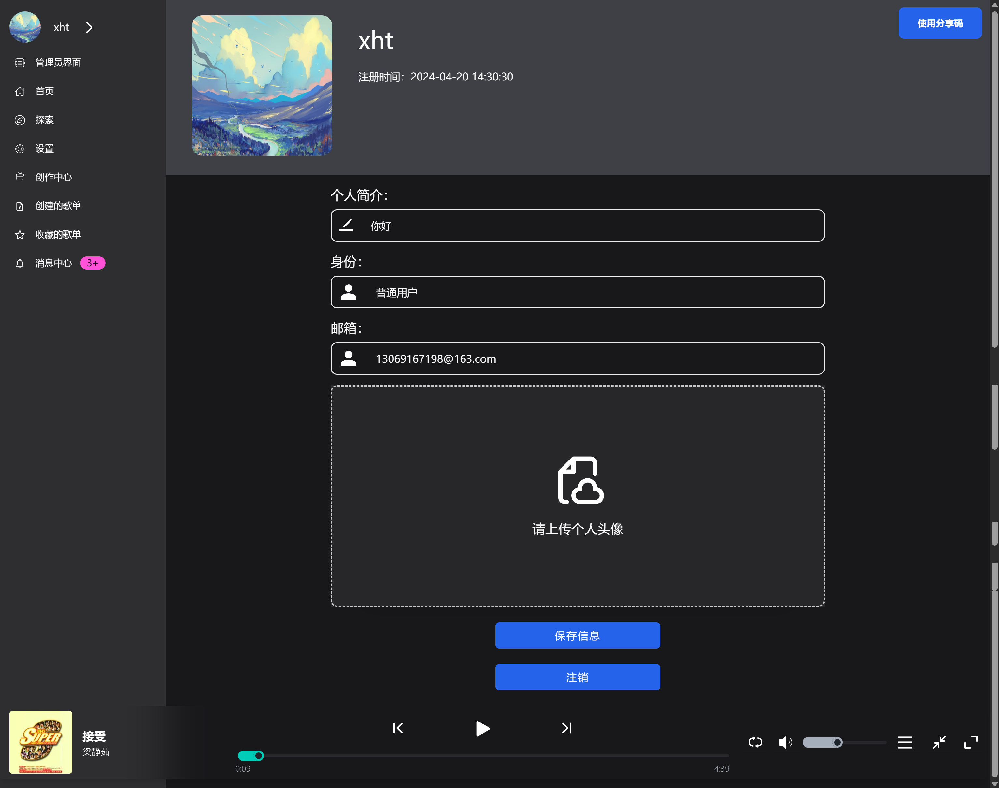

**页面内容及功能介绍：**

在登录完成之后左上角会显示当前的用户名和头像，点击这个部分可以进入个人信息界面，在个人信息界面会显示个人简介，身份，邮箱以及注册时间，其中，个人简介和头像可以修改，个人简介可以直接在个人简介输入栏中修改，点击保存信息即可更新，头像可以点击下面的个人头像上传区域上传，点击之后选取本地图片后上传即可更新头像。点击注销可以退出登录。

#### 5.2.2 使用分享码

**页面展示：**

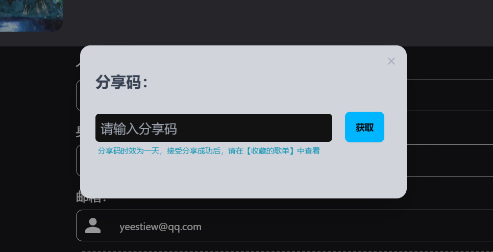

**页面内容及功能介绍：**

用户可以在输入框中输入分享码，点击获取后，成功接受分享的歌单，并添加到【收藏的歌单】中。分享码时效为一天，若接受分享失败，则必须重新获取分享码。

### 5.3 首页

#### 5.3.1 推荐页面

**页面展示：**

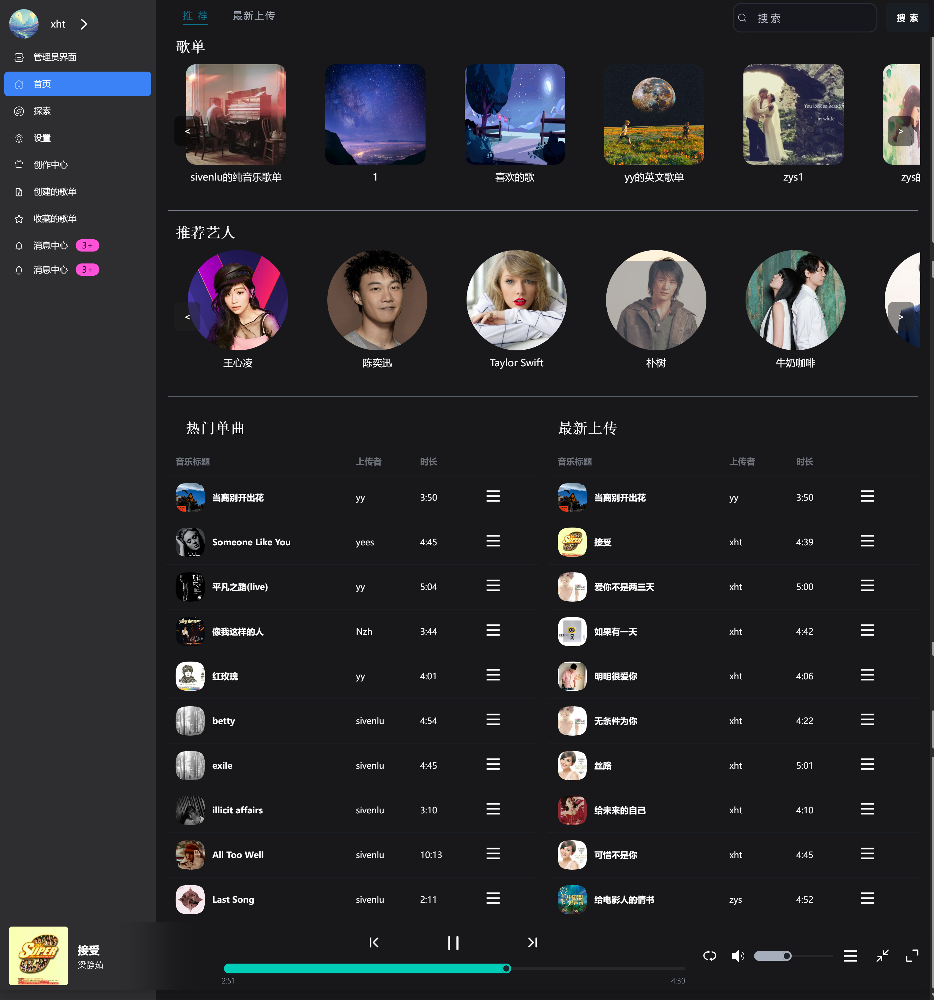

**页面内容及功能介绍：**

在推荐界面中显示推荐歌单、推荐艺人、热门单曲以及最新上传歌曲。点击推荐歌单可以查看歌单详情，点击推荐艺人可以看到艺人的所有歌曲，单击下面的歌曲部分可以播放歌曲，点击右面的详情按钮可以使用复杂操作，包括立即播放、添加到播放列表、添加到歌单以及查看详细信息。

#### 5.3.2 最新上传页面

**页面展示：**

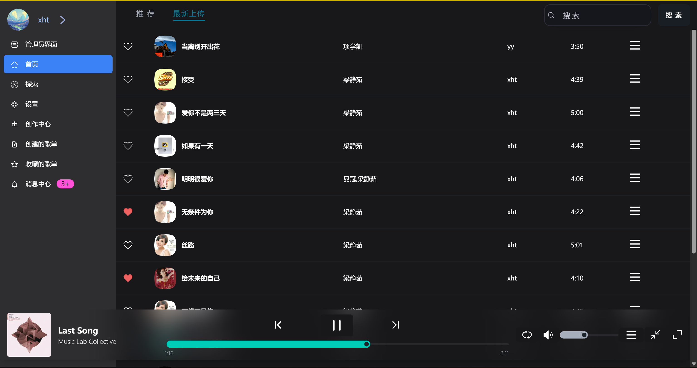

**页面内容及功能介绍：**

在最新上传界面可以看到最新的15首上传的歌曲，点击左面的小红心可以选择是否喜欢歌曲，单击歌曲行区域可以播放歌曲，右面的详情按钮和推荐界面中的功能相同，不再重复。

#### 5.3.3 搜索页面

**页面展示：**

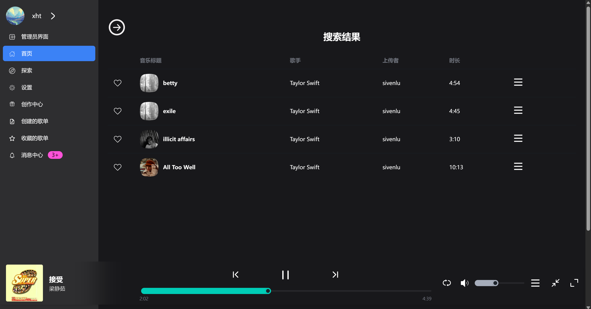

**页面内容及功能介绍：**

在首页的搜索框中输入搜索内容之后点击搜索按钮，会呈现出搜索结果，这里的搜索方式支持搜索歌手以及歌曲同时支持模糊搜索。搜索结果的操作方式和其他的歌曲操作是相同的。

#### 5.3.4 歌单页面

**页面展示：**

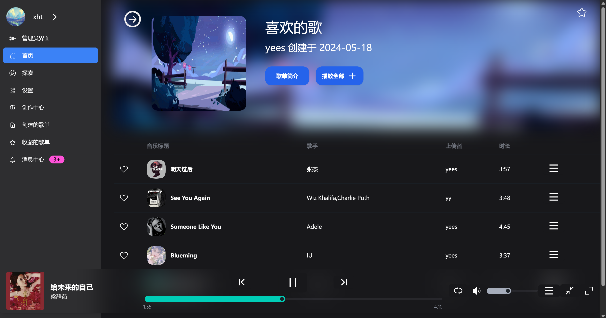

**页面内容及功能介绍：**

进入歌单详情界面可以看到当前的歌单详情，上半部分显示的是歌单的封面，右侧分别为歌单的名称、歌单创建者名称、歌单创建时间、点击歌单简介按钮可以看到歌单的简介，点击播放全部可以播放歌单中全部的歌曲。

下半部分为所有的歌曲，歌曲的操作和之前操作相同，不多赘述。

#### 5.3.5 艺人页面

**页面展示：**

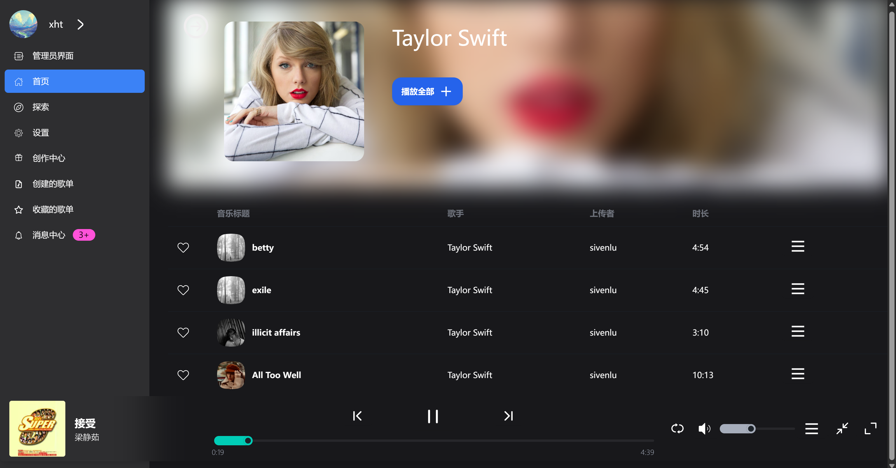

**页面内容及功能介绍：**

进入艺人的界面可以看到当前艺人的所有歌曲，点击播放全部按钮可以播放该艺人的所有歌曲，点击下面的单个歌曲可以分别播放对应的歌曲。

### 5.4 探索页面

#### 5.4.1 推荐歌曲页面

**页面展示：**

**页面内容及功能介绍：**

进入推荐歌曲界面，可以看到上半部分是通过多个筛选条件来筛选歌曲的部分，通过选择不同的条件可以筛选出对应的条件的歌曲，下面的歌曲操作和上面类似。

#### 5.4.2 推荐歌单页面

**页面展示：**

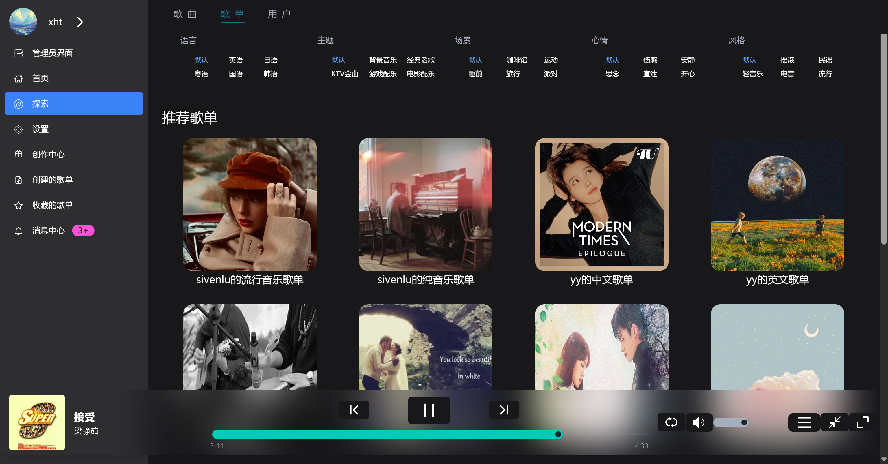

**页面内容及功能介绍：**

在推荐歌单界面上半部分也有筛选条件的选择部分，选择的逻辑和推荐歌曲相同，在下面会展示出推荐的歌单，点击歌单可以进入歌单详情界面。

#### 5.4.3 推荐用户页面

**页面展示：**

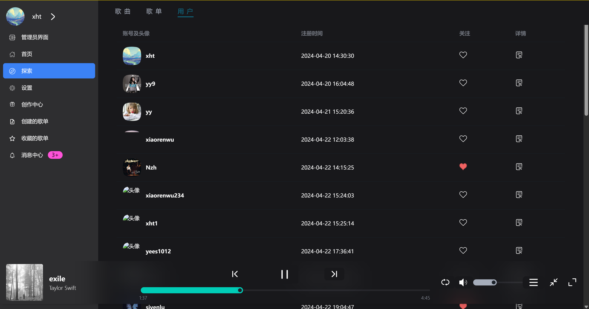

**页面内容及功能介绍：**

进入推荐用户界面，可以看到罗列出来的用户，在这里可以选择关注用户或者取消关注。点击详情可以进入用户的详情界面。

#### 5.4.4 用户详情页面

**页面展示：**

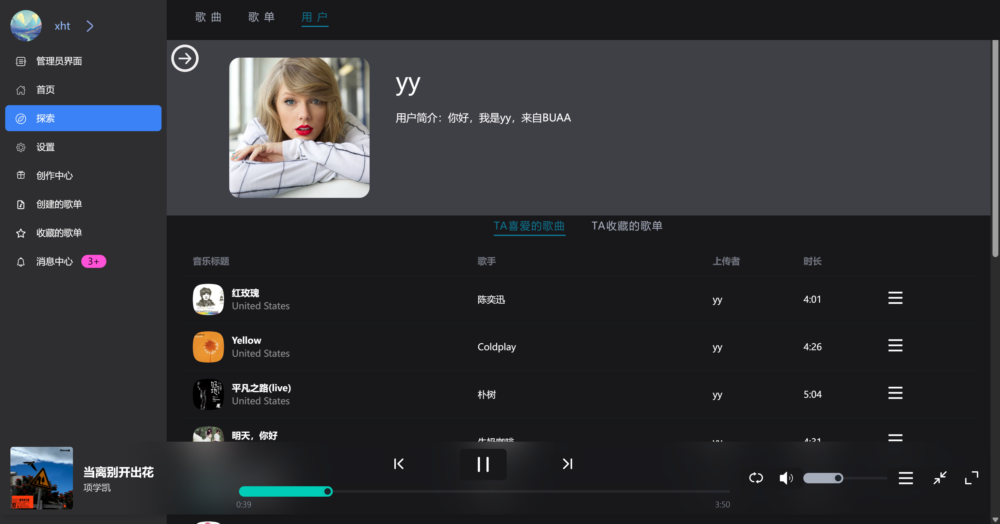

**页面内容及功能介绍：**

进入用户详情界面中可以看到用户的头像以及用户的简介，在下半部分可以看到用户喜爱的歌曲以及用户收藏的歌单。在用户喜爱的歌曲部分可以看到用户喜爱的所有歌曲，歌曲的操作和上面相同。在用户收藏的歌单界面可以看到用户收藏的所有歌单，点击用户收藏的歌单可以查看用户收藏的歌单的详细信息。

### 5.5 创作中心

#### 5.5.1 我的上传页面

**页面展示：**

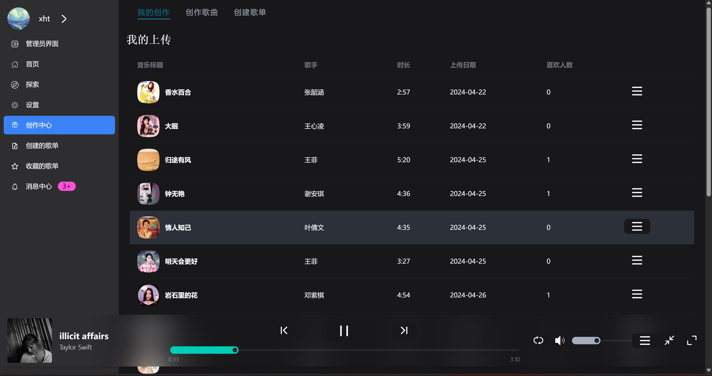

**页面内容及功能介绍：**

在我的上传界面可以看到当前登录用户所有已上传的歌曲，在这个界面的歌曲详细信息要相比前面的页面更加丰富，包括了上传的日期以及喜欢的人数。同时在右侧的详情按钮展开之后多了一个编辑歌曲的选项，点击之后可以进入编辑歌曲的界面。

#### 5.5.2 编辑歌曲页面

**页面展示：**

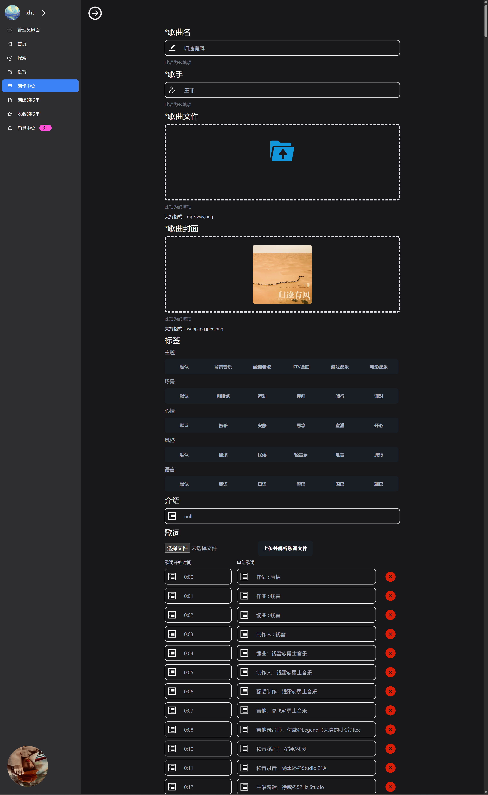

**页面内容及功能介绍：**

在编辑歌曲界面显示了目前歌曲已有的信息，可以在这个界面进行对于目前的歌曲信息进行更改，在进行完修改之后点击最下面的更新歌曲信息可以进行信息的保存，同时可以选择歌词文件，并点击“上传并解析歌词文件”这个按钮，可以进行本地歌词文件的解析并进行对于下面的歌词文件分割的自动更新。

#### 5.5.3 创作歌曲页面

**页面展示：**

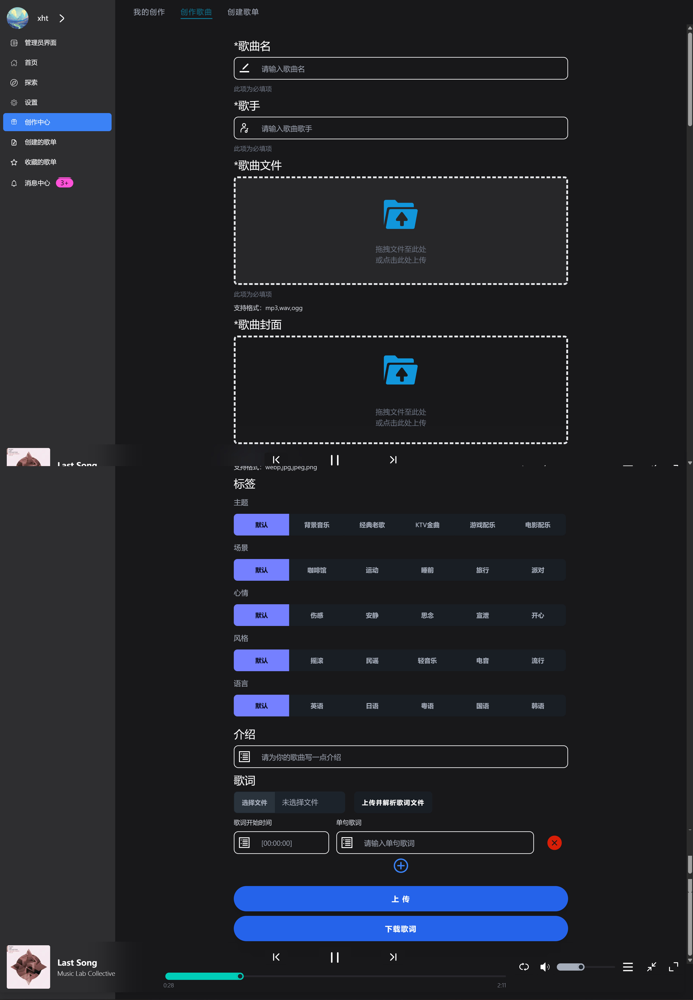

**页面内容及功能介绍：**

在创作歌曲界面包含输入歌曲名、输入歌手名、上传歌曲文件、上传歌曲封面、选择标签、输入介绍以及上传歌词文件的功能，其中输入歌曲名、上传歌手名、上传歌曲文件以及上传歌曲封面这四项是必需的。标签如果不选择的话会自动选择默认。歌词文件可以从本地上传，在上传文件完成之后点击上传并解析歌词文件可以自动将解析后的歌词文件填充到下面的输入框中，用户可以自己选择改动输入框中的歌词时间和歌词内容，如果用户想要下载歌词的话也可以点击下载歌词按钮下载歌词，歌词会自动以lrc格式文件保存。点击上传即可上传歌曲。

#### 5.5.4 创建歌单页面

**页面展示：**

**页面内容及功能介绍：**

创建歌单的界面和创建歌曲的界面类似，包括输入歌单标题，上传歌单封面，输入歌单介绍，选择歌单标签的部分，其中歌单标题和歌单封面是必需的。标签在不手动选择的情况下会自动选择默认，点击创建歌单即可创建歌单。

### 5.6 创建的歌单页面

#### 5.6.1 创建的歌单主页面

**页面展示：**

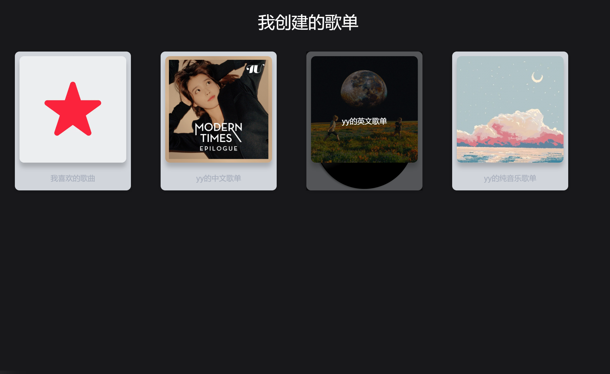

**页面内容及功能介绍：**

创建的歌单可以看到此用户历史上传的所有歌单。系统会为用户喜欢的歌曲自动创建一个歌单。当鼠标移动至歌单上方时可以看到播放动画。单击歌单用户进入歌单详情页面（详情见5.6.3）。

#### 5.6.2 我喜欢的歌曲页面

**页面展示：**

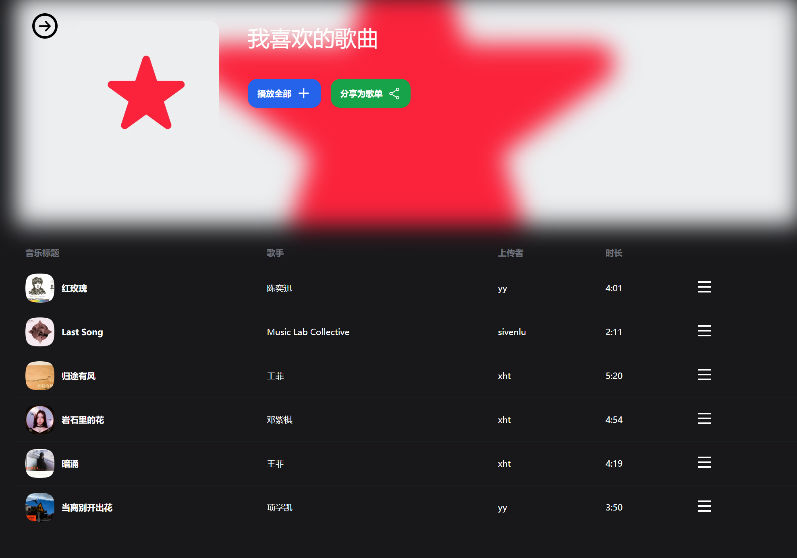

**页面内容及功能介绍：**

我喜欢的歌曲界面上方包括两个按钮：

- 点击播放全部按钮，会自动播放全部我喜欢的歌曲
- 点击分享为歌单按钮，系统将根据我喜欢的歌曲创建一个歌单，用户可以将此歌单分享给自己的好友，或使用分享码分享给任意用户。

界面下方为我喜欢的歌曲详细信息，每一行为一首我喜欢的歌曲，点击此歌曲会自动播放此歌曲。

点击歌曲右方操作按钮可以执行复杂操作，包括立即播放、添加到播放列表、查看详细信息、删除歌曲

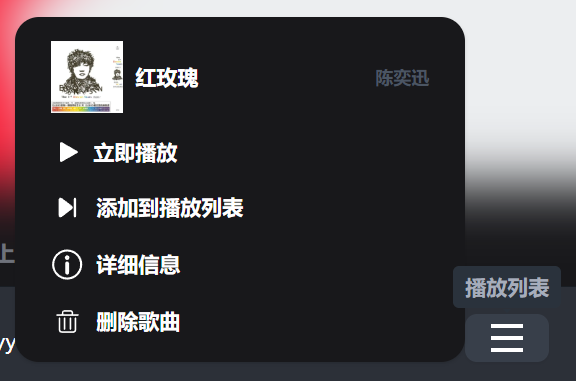

#### 5.6.3 创建的歌单详情页面

**页面展示：**

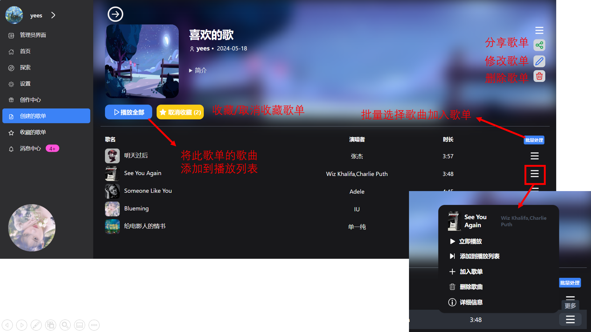

**页面内容及功能介绍：**

1. 歌单封面
2. 歌单名称
3. 歌单创建者
 - 功能：点击可以进入歌单创建者的个人主页
5. 歌单创建日期
6. 歌单简介
 - 已隐藏，点击可以展开查看
7. 播放全部按钮
 - 功能：点击可以将此歌单的全部歌曲添加到播放列表并进行播放
8. 收藏/取消收藏歌单按钮
 - 功能：若未收藏此歌单，此按钮将是灰色的，点击可以收藏此歌单，并添加到【收藏的歌单】中；若已收藏此歌单，此按钮将是黄色的，点击可以将此歌单从【收藏的歌单】中移除
9. 分享歌单按钮
 - 功能：点击进入分享歌单页面（详情见 5.6.5）
10. 修改歌单按钮
 - 功能：点击进入修改歌单页面（详情见 5.6.4）
11. 删除歌单按钮
 - 功能：删除此歌单
11. 歌曲列表
 - 展示此歌单中的所有歌曲，包括歌曲封面、歌曲名、歌手和时长
12. 批量处理按钮
 - 功能：点击将在每一行出现复选框让用户选择歌曲，可以批量将歌曲加入歌单，点击加入歌单后，将进入选择歌单界面（详情见 5.6.6）
13. 立即播放按钮
 - 功能：点击将立即播放选中歌曲
14. 添加到播放列表按钮
 - 功能：点击后，该歌曲将被加入播放列表等待播放
15. 加入歌单按钮
 - 功能：点击后进入加入歌单选择页面（详情见 5.6.6）
16. 删除歌曲按钮
 - 功能：点击后，该歌曲将从此歌单移除，而不是在全局删除此歌曲
17. 详细信息按钮
 - 功能：点击后将进入该歌曲的详情页面（详情见5.8.1）

#### 5.6.4 修改歌单页面

用户可以在修改歌单界面的输入框中修改歌单的歌单名、介绍，点击歌单头像可以从本地上传文件以更新歌单头像，点击歌曲右侧删除按钮可以从此歌单中删除歌曲。点击取消按钮将取消修改，点击 完成按钮将保存当前所有修改。

**页面内容及功能介绍：**

1. 歌单封面
 - 功能：点击更换歌单封面
 - 操作步骤：点击歌单封面，出现文件路径对话框，选择新的图片，歌单封面便会更换成新的图片
2. 歌单名输入框
3. 歌单介绍输入框
4. 歌单标签下拉单选框
5. 歌曲列表
 - 展示此歌单中的所有歌曲，包括歌曲封面、歌曲名、歌手和时长
6. 移除歌曲按钮
 - 功能：将歌曲从当前歌单中移除，而不是在全局删除
 - 操作步骤：点击移除歌曲的按钮（红色的删除图标），相应的歌曲将从当前歌单中移除
7. 取消按钮
 - 功能：取消修改歌单操作
 - 操作步骤：点击取消按钮，所有修改将取消，回到上一个页面
8. 完成按钮
 - 功能：修改歌单信息
 - 操作步骤：点击完成按钮，实现所有修改，完成歌单信息的编辑

#### 5.6.5 分享歌单页面

**页面展示：**

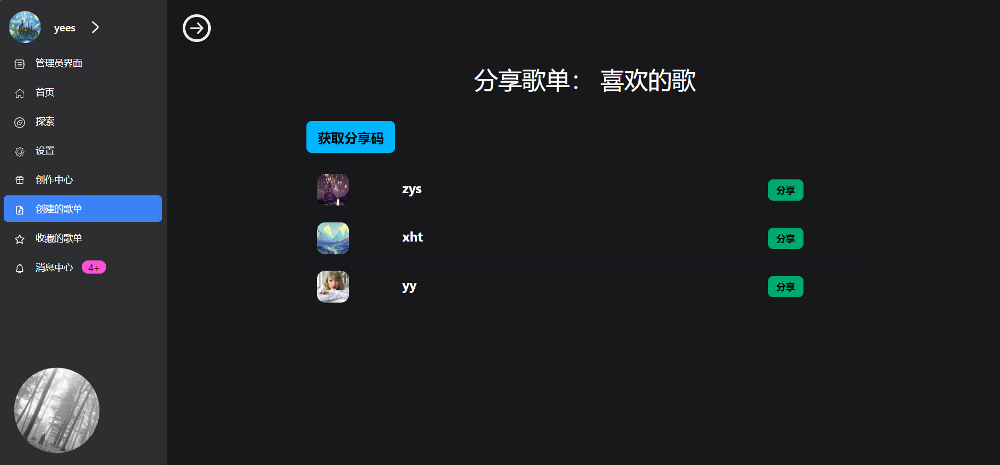

**页面内容及功能介绍：**

1. 获取分享码按钮
 - 功能：获取该歌单的分享码，时效为一天，可以在【个人主页】中使用分享码（详情见 5.2.2）
2. 互关的用户列表
 - 展示所有互关的用户，方便用户选择要分享的对象
3. 分享按钮
 - 点击后，该歌单将以私信的形式分享给选择的用户，而用户可以通过私信中的获取按钮来接受分享（详情见 5.10.6）

#### 5.6.6 加入歌单选择页面

**页面展示：**

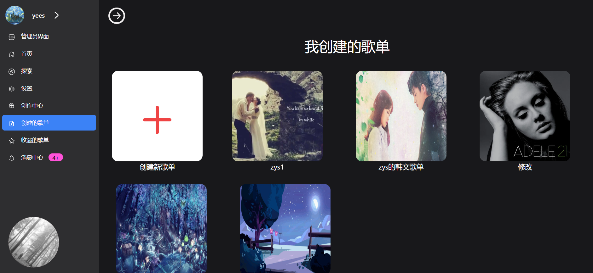

**页面内容及功能介绍：**

1. 用户创建的歌单
 - 功能：点击表示选择加入该歌单
2. 创建新歌单
 - 功能：点击后跳转到创建歌单页面（详情见 5.5.4），创建好后，选择的歌曲将自动加入此歌单

### 5.7 收藏的歌单页面

#### 5.7.1 收藏的歌单主页面

**页面展示：**

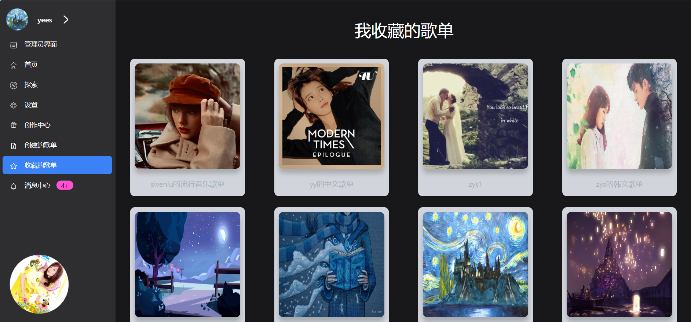

**页面内容及功能介绍：**

1. 用户收藏的歌单
 - 功能：点击可进入收藏的歌单详情页面（详情见 5.7.2）

#### 5.7.2 收藏的歌单详情界面

**页面展示：**

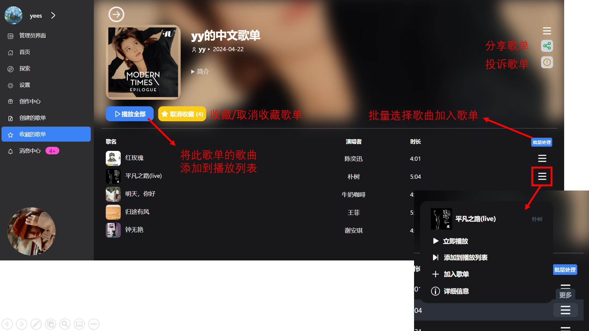

**页面内容及功能介绍：**

1. 歌单封面
2. 歌单名称
3. 歌单创建者
 - 功能：点击可以进入歌单创建者的个人主页
4. 歌单创建日期
5. 歌单简介
 - 已隐藏，点击可以展开查看
6. 播放全部按钮
 - 功能：点击可以将此歌单的全部歌曲添加到播放列表并进行播放
7. 收藏/取消收藏歌单按钮
 - 功能：若未收藏此歌单，此按钮将是灰色的，点击可以收藏此歌单，并添加到【收藏的歌单】中；若已收藏此歌单，此按钮将是黄色的，点击可以将此歌单从【收藏的歌单】中移除
8. 分享歌单按钮
 - 功能：点击进入分享歌单页面（详情见 5.6.5）
9. 投诉歌单按钮
 - 功能：功能：点击将跳转到投诉歌单页面（详情见 5.7.3）
10. 歌曲列表
 - 展示此歌单中的所有歌曲，包括歌曲封面、歌曲名、歌手和时长
11. 批量处理按钮
 - 功能：点击将在每一行出现复选框让用户选择歌曲，可以批量将歌曲加入歌单，点击加入歌单后，将进入选择歌单界面（详情见 5.6.6）
12. 立即播放按钮
 - 功能：点击将立即播放选中歌曲
13. 添加到播放列表按钮
 - 功能：点击后，该歌曲将被加入播放列表等待播放
14. 加入歌单按钮
 - 功能：点击后进入加入歌单选择页面（详情见 5.6.6）
15. 详细信息按钮
 - 功能：点击后将进入该歌曲的详情页面（详情见5.8.1）

#### 5.7.3 投诉歌单页面

**页面展示：**

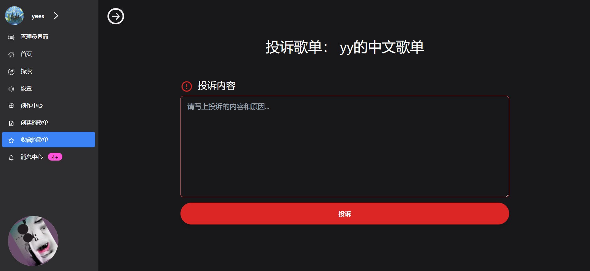

**页面内容及功能介绍：**

1. 投诉的歌单名
2. 投诉内容输入框
 - 功能：输入投诉内容
3. 投诉按钮
 - 功能：点击后，将发送投诉内容投诉此歌单，然后应等待管理员进行处理

### 5.8 歌曲详情界面

#### 5.8.1 歌曲详情界面

**页面展示：**

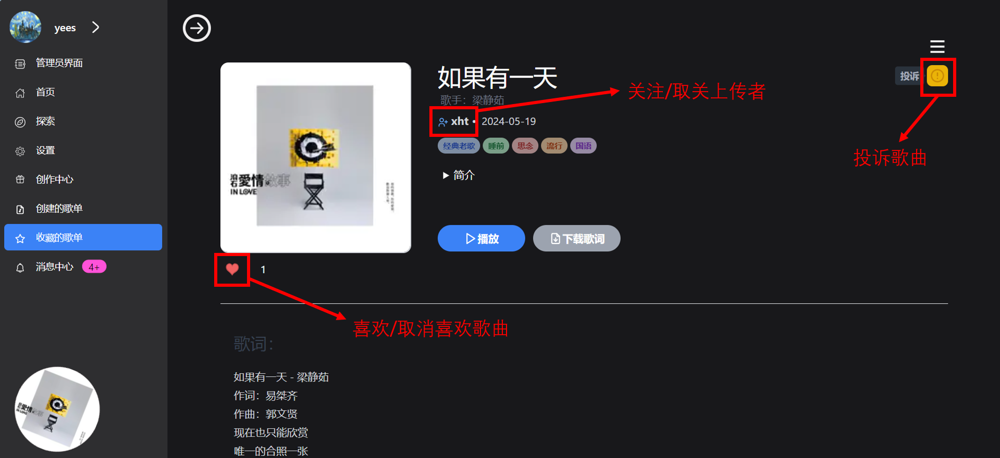

**页面内容及功能介绍：**

1. 歌曲封面
2. 歌曲名
3. 歌手
4. 上传者
 - 功能：若未关注此用户，点击可以关注；若已关注此用户，点击可以取消关注
5. 上传日期
6. 歌曲标签
7. 歌曲简介
 - 已隐藏，点击可以展开查看
8. 播放按钮
 - 功能：点击可立即播放当前歌曲
9.  下载歌词按钮
 - 功能：点击可下载当前歌曲的歌词，下载的文件为.lrc文件
10. 投诉按钮
 - 功能：点击将跳转到投诉歌曲页面（详情见 5.8.2）
11. 喜欢歌曲按钮
 - 功能：若未喜欢这首歌曲，此按钮将是空心的爱心形状，点击可以将此歌曲标为喜欢的歌曲，并添加到【喜欢的歌曲】中；若已喜欢这首歌曲，此按钮将是红色的实心爱心形状，点击可以将此歌曲从【喜欢的歌曲】中移除

#### 5.8.2 投诉歌曲页面

**页面展示：**

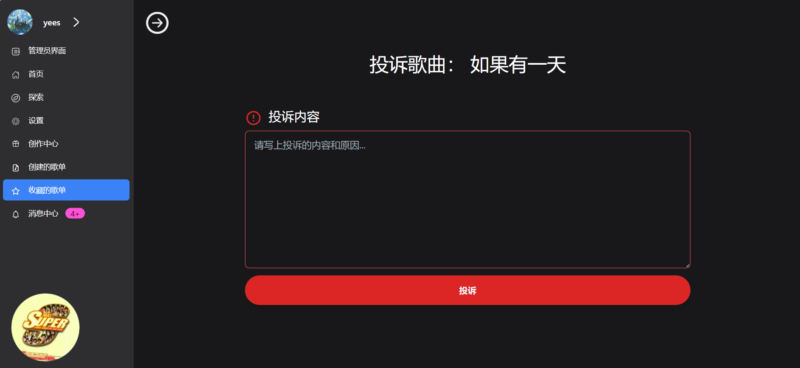

**页面内容及功能介绍：**

1. 投诉的歌曲名
2. 投诉内容输入框
 - 功能：输入投诉内容
3. 投诉按钮
 - 功能：点击后，将发送投诉内容投诉此歌曲，然后应等待管理员进行处理

### 5.9 歌曲播放页面

#### 5.9.1 歌曲播放控制栏

**页面展示：**

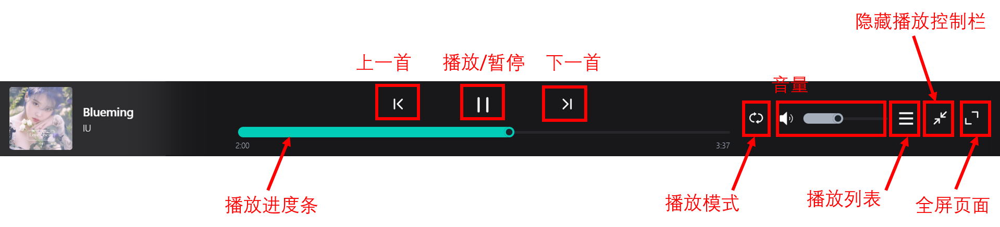

**页面内容及功能介绍：**

1. 当前播放的歌曲图片
2. 当前播放的歌曲名
3. 当前播放歌曲的歌手
4. 播放控制
 - 上一首
 - 暂停/播放
 - 下一首
5. 播放进度条
 - 功能：拖拽跳转歌曲进度
6. 播放模式
 - 功能：点击更换播放模式
 - 列表循环
 - 单曲循环
 - 随机播放
7. 音量
 - 功能：拖拽调整音量大小
8. 播放列表
 - 功能：点击查看当前播放列表
9.  隐藏播放控制栏
 - 功能：点击隐藏播放控制栏
10. 全屏展示播放页面
 - 功能：点击全屏展示播放页面（详情见 5.9.2）

#### 5.9.2 全屏展示播放页面

**页面展示：**

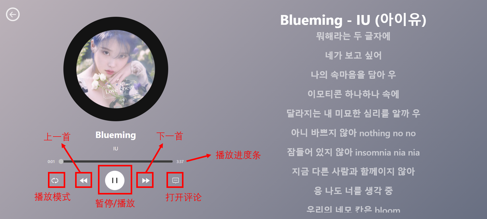

**页面内容及功能介绍：**

1. 当前播放的歌曲图片
2. 当前播放的歌曲名
3. 当前播放歌曲的歌手
4. 播放控制
 - 上一首
 - 暂停/播放
 - 下一首
5. 播放进度条
 - 功能：拖拽跳转歌曲进度
6. 播放模式
 - 功能：点击更换播放模式
 - 列表循环
 - 单曲循环
 - 随机播放
7. 评论
 - 功能：点击打开该歌曲的评论区（详情见5.9.3）

#### 5.9.3 评论

**页面展示：**

**页面内容及功能介绍：**

1. 用户的评论
2. 删除评论的操作按钮
 - 功能：删除自己发送的评论，无权删除其他用户发送的评论
 - 操作步骤：点击删除评论的按钮（红色的删除图标），相应的评论将被删除
3. 信息输入框
 - 功能：输入要发送的评论信息
4. 确认按钮
 - 功能：发送评论
 - 发送评论后，该歌曲的上传者将收到评论通知

### 5.10 消息中心

#### 5.10.1 系统通知页面

**页面展示：**

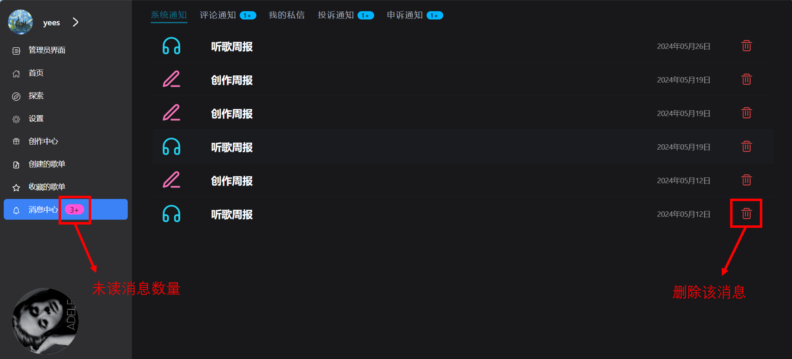

**页面内容及功能介绍：**

1. 听歌周报
 - 功能：查看听歌周报（详情见 5.10.2）
2. 创作周报
 - 功能：查看创作周报（详情见 5.10.3）
3. 收到信息的时间
4. 删除系统通知的操作按钮
 - 功能：删除系统通知
 - 操作步骤：点击删除系统通知的按钮（红色的删除图标），相应的系统通知将被删除

#### 5.10.2 听歌周报

**页面展示：**

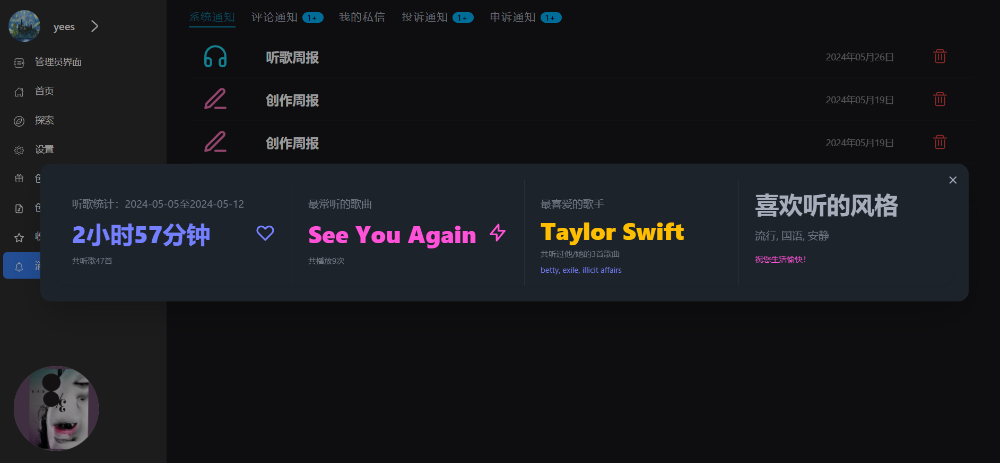

**页面内容：**

1. 听歌统计的日期
2. 听歌时长
3. 听歌数量
4. 最常听的歌曲名
5. 最常听的歌曲的播放次数
6. 最喜爱的歌手
7. 听过的最喜爱歌手的歌曲数量
8. 听过的最喜爱歌手的歌曲名
9. 喜欢听的风格

#### 5.10.3 创作周报

**页面展示：**

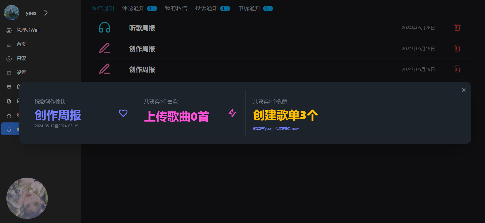

**页面内容：**

1. 创作统计的日期
2. 共获得用户喜欢歌曲的数量
3. 上传的歌曲数量
4. 上传的歌曲名
5. 共获得用户收藏歌单的数量
6. 创建的歌单数量
7. 创建的歌单名

#### 5.10.4 评论通知页面

**页面展示：**

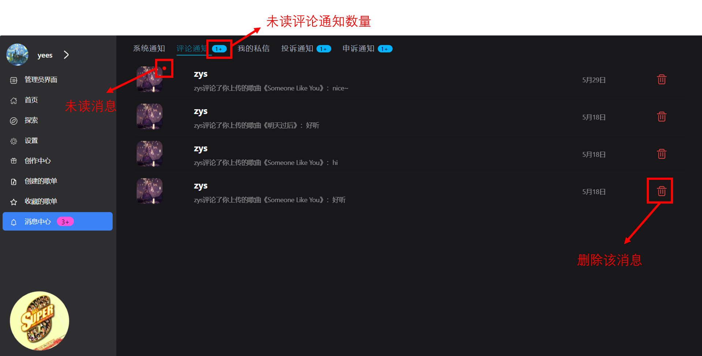

**页面内容及功能介绍：**

1. 发送该评论的用户头像
2. 发送该评论的用户名
3. 评论的内容
4. 收到该评论的时间
5. 删除评论通知的操作按钮
 - 功能：删除评论通知，不是删除评论
 - 操作步骤：点击删除评论通知的按钮（红色的删除图标），相应的评论通知将被删除
6. 评论通知
 - 点击某条评论通知，将跳转到相应的歌曲详情页面（详情见 5.8.1），播放该歌曲后，全屏展示播放页面（详情见 5.9.2），便能查看该歌曲的评论（详情见 5.9.3）

#### 5.10.5 私信页面

**页面展示：**

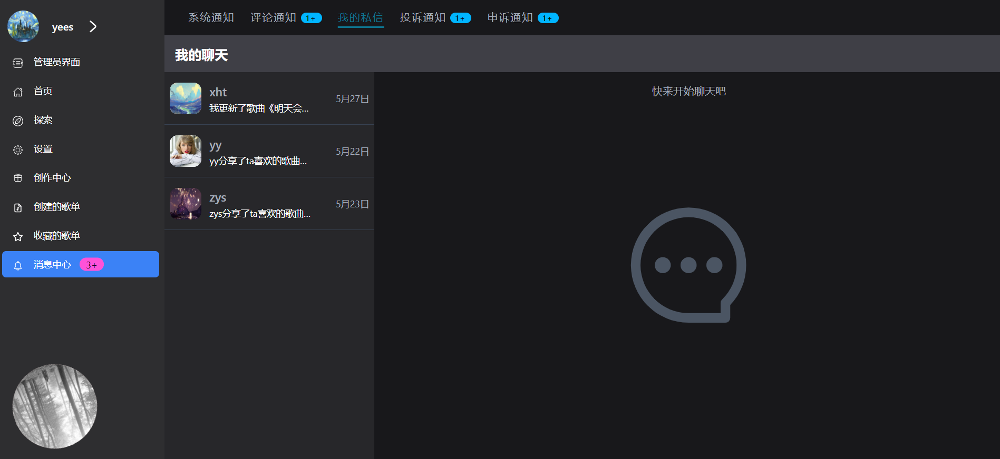

**页面内容及功能介绍：**

1. 关注的用户头像
2. 关注的用户名
3. 与该用户的最后一条聊天信息
4. 与该用户的最后一条聊天信息的发送时间
5. 私信
 - 点击某条私信，将在右侧展示与该用户的聊天记录并可与该用户聊天（详情见 5.10.6）

#### 5.10.6 聊天页面

**页面展示：**

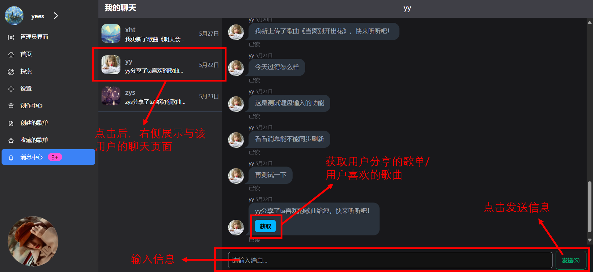

**页面内容及功能介绍：**

1. 与该用户的聊天记录
2. 信息输入框
3. 信息发送按钮
 - 功能：将输入框中的信息发送给当前用户，只有互关的用户才能发送信息
4. 获取用户分享的歌单/用户喜欢的歌曲的按钮
 - 功能：该获取按钮时效为一天，若成功获取，请在【收藏的歌单】中查看（详情见 5.7.1）；若获取失败，表示此分享入口不存在或已失效，请重新分享

#### 5.10.7 投诉通知页面

**页面展示：**

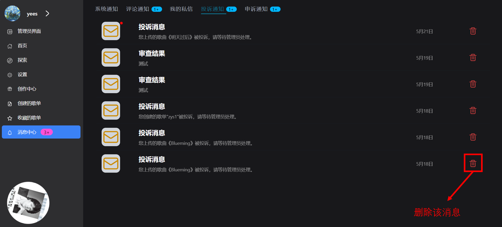

**页面内容及功能介绍：**

1. 投诉消息
 - 功能：查看投诉消息
 - 当有用户投诉上传的歌曲/创建的歌单，则收到投诉消息，并需要等待管理员处理
 - 点击后将跳转到被投诉的歌曲（详情见 5.8.1）/歌单详情页面（详情见 5.6.3）
2. 审查结果
 - 功能：查看审查结果
 - 对用户投诉的审查结果，是否下架该歌曲/歌单
 - 点击后将跳转到审查结果页面
3. 收到该投诉通知的时间
4. 删除投诉通知的操作按钮
 - 功能：删除投诉通知
 - 操作步骤：点击删除投诉通知的按钮（红色的删除图标），相应的投诉通知将被删除

#### 5.10.8 申述通知页面

**页面展示：**

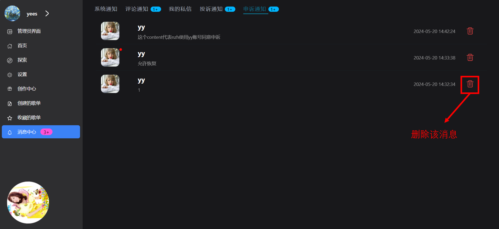

**页面内容及功能介绍：**

1. 申述通知
 - 功能：查看申述结果
 - 对用户申述的审查结果，是否撤销对该歌曲/歌单的下架操作
 - 点击后将跳转到审查结果页面
2. 收到该申述通知的时间
3. 删除申述通知的操作按钮
 - 功能：删除申述通知
 - 操作步骤：点击删除申述通知的按钮（红色的删除图标），相应的申述通知将被删除

### 5.11 管理员界面

#### 5.11.1 管理歌单页面

**页面展示：**

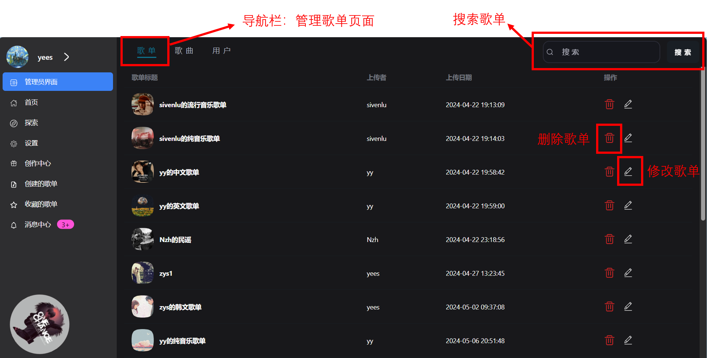

**页面内容及功能介绍：**

1. 搜索框
 - 功能：搜索歌单
 - 操作步骤：在输入框中输入歌单名，点击搜索后，将跳到搜索结果页面（详情见 5.11.2）
 - 目的：帮助管理员更迅速和准确的找到和查看歌单
2. 歌单封面
3. 歌单标题
4. 上传者
5. 上传日期
6. 删除歌单操作按钮
 - 功能：删除歌单
 - 操作步骤：点击删除歌单的按钮（红色的删除图标），相应的歌单将被删除
 - 目的：当用户投诉歌单（详情见 5.7.3）后，经过管理员审查，决定下架该歌单，便能通过这个功能将歌单删除
7. 修改歌单操作按钮
 - 功能：进入编辑歌单页面（详情见 5.11.3）

#### 5.11.2 歌单搜索结果页面

**页面展示：**

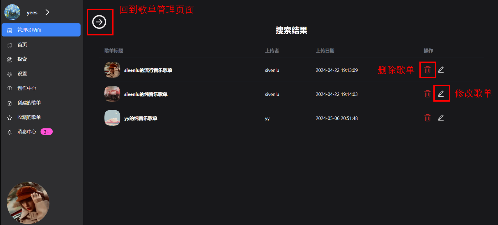

**页面内容及功能介绍：**

1. 歌单封面
2. 歌单标题
3. 上传者
4. 上传日期
5. 删除歌单操作按钮
 - 功能：删除歌单
 - 操作步骤：点击删除歌单的按钮（红色的删除图标），相应的歌单将被删除
 - 目的：当用户投诉歌单（详情见 5.7.3）后，经过管理员审查，决定下架该歌单，便能通过这个功能将歌单删除
6. 修改歌单操作按钮
 - 功能：进入编辑歌单页面（详情见 5.11.3）

#### 5.11.3 编辑歌单页面

**页面展示：**

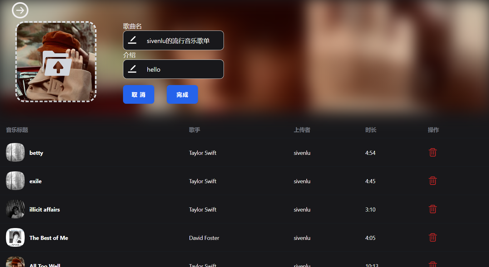

**页面内容及功能介绍：**

1. 歌单封面更换
 - 功能：点击更换歌单封面
 - 操作步骤：点击歌单封面，出现文件路径对话框，选择新的图片，歌单封面便会更换成新的图片
2. 歌单名文本输入框
3. 介绍文本输入框
4. 取消操作按钮
 - 功能：取消修改歌单操作
 - 操作步骤：点击取消按钮，所有修改将取消，回到上一个页面
5. 完成操作按钮
 - 功能：修改歌单信息
 - 操作步骤：点击完成按钮，实现所有修改，完成歌单信息的编辑
6. 音乐标题
7. 歌手
8. 上传者
9. 时长
10. 移除歌曲操作按钮
 - 功能：将歌曲从当前歌单中移除，而不是在全局删除
 - 操作步骤：点击移除歌曲的按钮（红色的删除图标），相应的歌曲将从当前歌单中移除

#### 5.11.4 管理歌曲页面

**页面展示：**

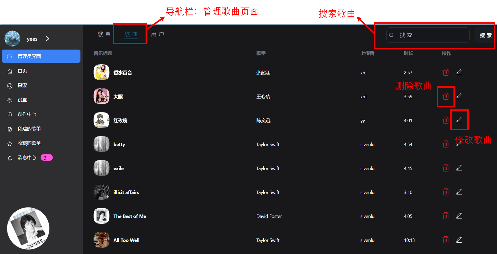

**页面内容及功能介绍：**

1. 搜索框
 - 功能：搜索歌曲
 - 操作步骤：在输入框中输入歌曲名或歌手名，点击搜索后，将跳到搜索结果页面（详情见 5.11.5）
 - 目的：帮助管理员更迅速和准确的找到和查看歌曲
2. 歌曲封面
3. 歌曲标题
4. 歌手
5. 上传者
6. 时长
7. 删除歌曲操作按钮
 - 功能：删除歌曲
 - 操作步骤：点击删除歌曲的按钮（红色的删除图标），相应的歌曲将被删除
 - 目的：当用户投诉歌歌曲（详情见 5.8.2）后，经过管理员审查，决定下架该歌曲，便能通过这个功能将歌曲删除
8. 修改歌曲操作按钮
 - 功能：进入编辑歌曲页面（详情见 5.5.2）

#### 5.11.5 歌曲搜索结果页面

**页面展示：**

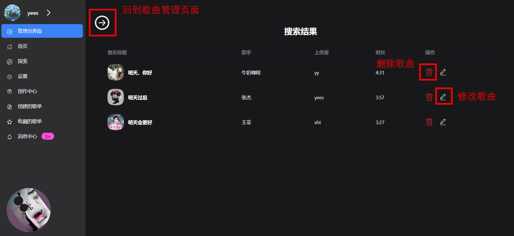

**页面内容及功能介绍：**

1. 歌曲封面
2. 歌曲标题
3. 歌手
4. 上传者
5. 时长
6. 删除歌曲操作按钮
 - 功能：删除歌曲
 - 操作步骤：点击删除歌曲的按钮（红色的删除图标），相应的歌曲将被删除
 - 目的：当用户投诉歌歌曲（详情见 5.8.2）后，经过管理员审查，决定下架该歌曲，便能通过这个功能将歌曲删除
7. 修改歌曲操作按钮
 - 功能：进入编辑歌曲页面（详情见 5.5.2）

#### 5.11.6 管理用户页面

**页面展示：**

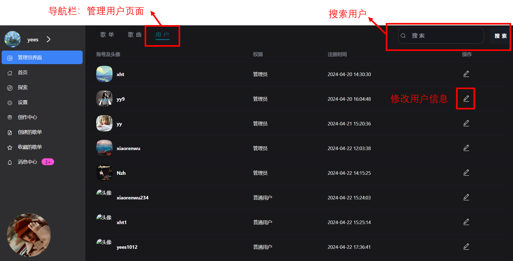

**页面内容及功能介绍：**

1. 账号及头像
2. 权限
 - 管理员
 - 普通用户
3. 注册时间
4. 修改用户信息操作按钮
 - 功能：进入编辑用户信息页面（详情见 5.11.7）

#### 5.11.7 编辑用户信息页面

**页面展示：**

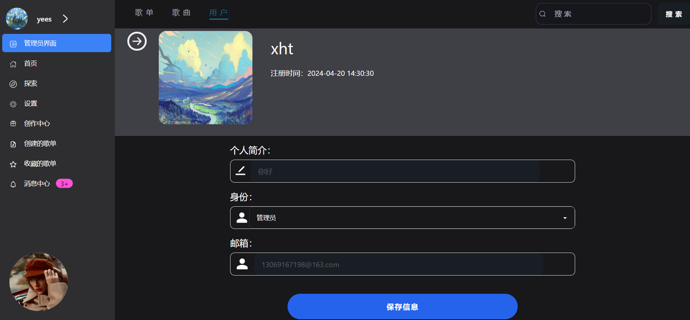

**页面内容及功能介绍：**

1. 用户头像
2. 账号名字
3. 注册时间
4. 个人简介
5. 身份
 - 管理员可以修改用户的身份为管理员或普通用户，分别对应不同的权限
6. 邮箱
7. 保存信息操作按钮
 - 功能：保存修改的用户信息

#### 5.11.8 处理投诉页面

**页面展示：**

**页面内容及功能介绍：**

1. 投诉原因
2. 处理选择框
3. 处理理由
 - 功能：管理员输入处理理由，处理理由会以消息的形式发送给投诉用户和被投诉用户
4. 被投诉歌曲/歌单详细信息

#### 5.11.9 处理申诉页面

**页面展示：**

**页面内容及功能介绍：**

1. 投诉原因
2. 申诉原因
3. 处理选择框
4. 处理理由

 - 功能：管理员输入处理理由，处理理由会以消息的形式发送给申诉用户

4. 被投诉歌曲/歌单详细信息